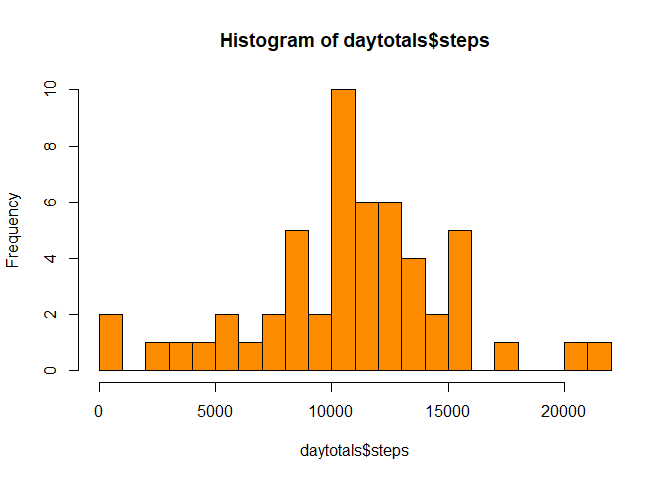
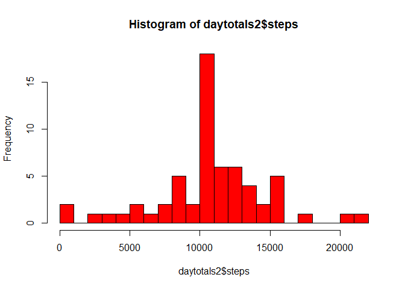

## Loading and preprocessing the data
The datafile that is used for this analysis is the recording of steps taken by an anonimous individual, measured in 5-minutes interval. The measurements are recorded over a two month period, 
from 1 October 2012 until 30 November 2012.

The datafile has been put in the same working directory as the R Markdown file.
When opening the R Markdown file, the working directory is that very directory where the data can be read from. 
The data is stored in the dataframe "stepfile".


```r
library(knitr)
library(lubridate)
```

```
## 
## Attaching package: 'lubridate'
```

```
## The following object is masked from 'package:base':
## 
##     date
```

```r
 stepfile <- read.csv(file = "./activity.csv")
 stepfile$date <- as.Date(stepfile$date)
 opts_chunk$set(echo = TRUE)
```

## What is mean total number of steps taken per day?
In order to calculate the mean of the total numbers of steps taken per day, I first need to know the total number of steps per day.
For this I am going to group on date and summarize the number of steps. 
I am appointing the result to the variable "daytotals".
For grouping the data we need the dplyr-library. That must be loaded first.


```r
library(plyr)
```

```
## 
## Attaching package: 'plyr'
```

```
## The following object is masked from 'package:lubridate':
## 
##     here
```

```r
library(dplyr)
```

```
## 
## Attaching package: 'dplyr'
```

```
## The following objects are masked from 'package:plyr':
## 
##     arrange, count, desc, failwith, id, mutate, rename, summarise,
##     summarize
```

```
## The following objects are masked from 'package:lubridate':
## 
##     intersect, setdiff, union
```

```
## The following objects are masked from 'package:stats':
## 
##     filter, lag
```

```
## The following objects are masked from 'package:base':
## 
##     intersect, setdiff, setequal, union
```

```r
daytotals <- summarise(group_by(stepfile, date), steps=sum(steps))
```
The histogram below, created based on "daytotals", shows the frequency of the total number of steps per day over the two month period of the data.
In other words, on how many days did the individual take 0 -1000 steps, 1001-2000, 2001 - 3000, etetera. Thus, each bar represents a bandwidth of one thousand steps.


```r
hist(daytotals$steps, breaks = 25, col = "darkorange")
```

<!-- -->

The mean of total steps per day is


```r
mean(daytotals$steps, na.rm = TRUE)
```

```
## [1] 10766.19
```

The median of the total steps per day is

```r
median(daytotals$steps, na.rm = TRUE)
```

```
## [1] 10765
```


## What is the average daily activity pattern?

The average daily activity pattern is given by the averages of each interval across all days; the average of all intervals from 0:00 till 0:05 of all days, the average of all intervals 0:05 till 0:10 of all days, etcetera, right until the average of all intervals from 23:55 till 0:00 of all days. So these need to be calculated.
The dataframe "avgint" (short for 'average interval') contains the averages of the number of steps per interval over all days


```r
avgint <- summarise(group_by(stepfile, interval), steps=mean(steps, na.rm = TRUE))
```
The plot below shows the averages over the timeline of the intervals. The x-ax shows the times of the interval. The y-ax shows the number of steps.


```r
 with(avgint, plot(interval, steps, type = "l"))
```

<!-- -->

One interval clearly has the highest average of all:

```r
filter(avgint, avgint$steps == max(avgint$steps))
```

```
## # A tibble: 1 x 2
##   interval steps
##      <int> <dbl>
## 1      835  206.
```
From 8:35 till 8:40 the individual has, on average, made the most steps - 206.

## Imputing missing values
Within the data file there are missing values (NA). In total there are the following number if NA's:


```r
colSums(is.na(stepfile))
```

```
##    steps     date interval 
##     2304        0        0
```

The missing values are being filled with the average of the corresponding interval for all days.These averages have been calculated at the avgint-dataframe. These values are going to be used to fill the missing values of the stepfile.
For each missing value in "stepfile", I will look for the corresponding interval in "avgint".
When that interval has been found, the average number of steps that can be found in "avgint" will be entered into steps of "stepfile".


```r
for(j in 1:length(stepfile$steps)) 
{
    if(is.na(stepfile$steps[j])) 
    {
        intervalvalue <- stepfile[j,3]
        intervalrow <- filter(avgint, avgint$interval == as.integer(intervalvalue))
        numberofsteps <- intervalrow$steps
        stepfile[j,1] <- numberofsteps
    }
}

colSums(is.na(stepfile))
```

```
##    steps     date interval 
##        0        0        0
```
Now that the missing values have been replaced by the average of the similar intervals over all days, the histogram that we have made earlier can be made again. But now with all values filled.


```r
daytotals2 <- summarise(group_by(stepfile, date), steps=sum(steps))
hist(daytotals2$steps, breaks = 25, col = "red")
```

<!-- -->

As you can see the number of days that have between 10 thousand and 11 thousand
The adjusted mean of total steps per day is


```r
mean(daytotals2$steps, na.rm = TRUE)
```

```
## [1] 10766.19
```

The adjusted median of the total steps per day is

```r
median(daytotals2$steps, na.rm = TRUE)
```

```
## [1] 10766.19
```
As you can see, the mean and the median have the same value, where before the adding of the missing values, the median was slightly lower than the mean.
The mean after the adding of missing numbers is similar as the mean before the adding of the missing numbers.

## Are there differences in activity patterns between weekdays and weekends?
To the "stepfile" I add a factor variable indicating whether the day is in a weekday or in a weekend.Since my nativ language is Dutch, the names of the days are in Dutch as well within the condition for determining the factor - saturday and sunday respectively.


```r
stepfile <- mutate(stepfile, daytype = factor(weekdays(stepfile$date) %in% c("zaterdag", "zondag"), labels = c("weekday", "weekend")))
```
I am then averaging the intervals over the days, splitted by either weekday or weekend.
I am storing that in the varialble "avgint2" - average interval 2.
Based on "avgint2" I make the plot to compare the activity patterns between weekdays and weekend.


```r
avgint2 <- summarise(group_by(stepfile, interval, daytype), steps=mean(steps))
library(lattice)
xyplot(steps ~ interval | daytype, avgint2, layout = c(1,2), type = "l", ylab = "Number of steps", xlab = "Interval")
```

<!-- -->


